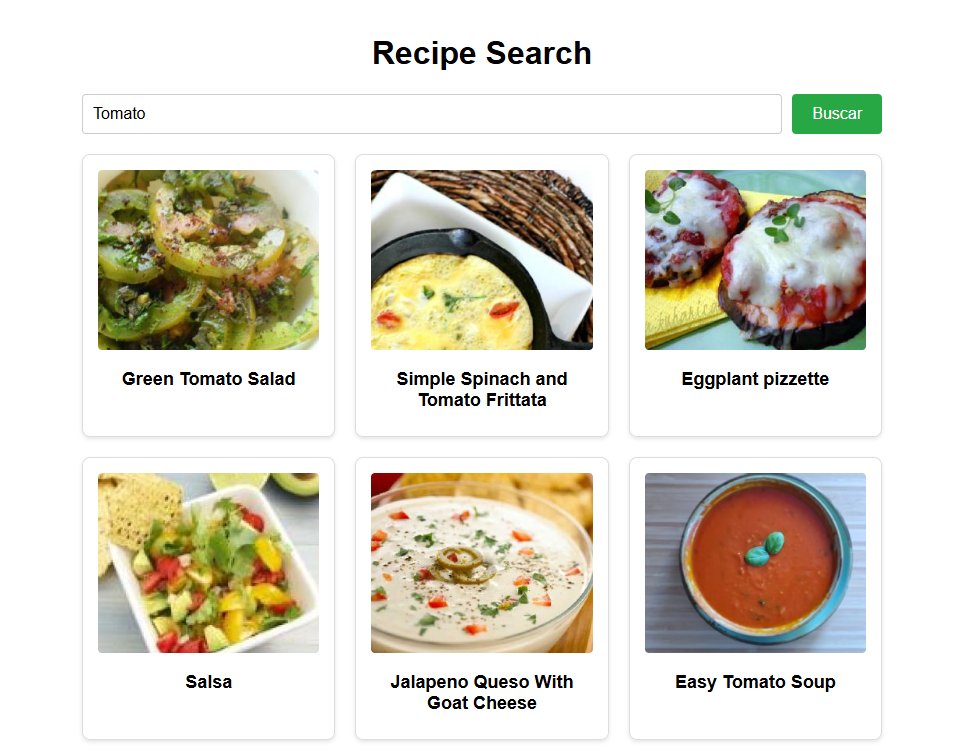
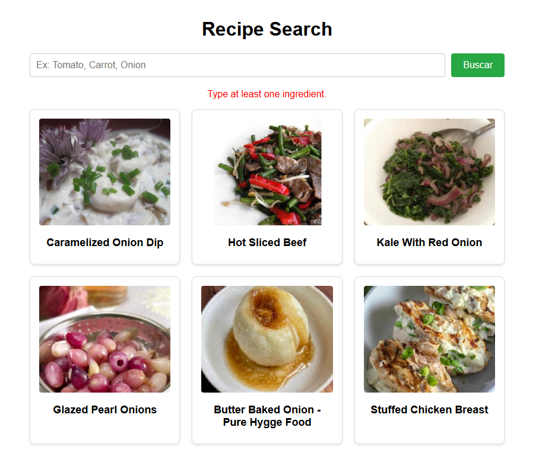

# Buscador de Receitas

Projeto de estudo desenvolvido para consolidar conhecimentos em comunicação cliente-servidor. A aplicação consiste em um frontend em React que consome dados de um backend próprio em Node.js, o qual atua como proxy seguro para a API externa da Spoonacular.

## Status do Projeto
Em desenvolvimento (Testes iniciais e configuração de rotas).

## Demonstração Visual

## Tecnologias Utilizadas
- React (Vite)
- Node.js
- Express
- Axios
- Spoonacular API

## Como Executar:

### Pré-requisitos:
- Node.js instalado.
- Chave gratuita gerada no site da Spoonacular API.

### Backend (Servidor):
1. Criar pasta server e dentro da pasta server instalar as dependências:

   npm install

2. Crie um arquivo .env na raiz da pasta server com as variáveis:

   PORT=5000
   SPOONACULAR_API_KEY=sua_chave_aqui

3. Iniciar o servidor:

   node index.js

### Frontend (Interface):

5. Criar pasta client e dentro da pasta client instale as dependências:

   npm install

6. Inicie o ambiente de desenvolvimento:

   npm run dev